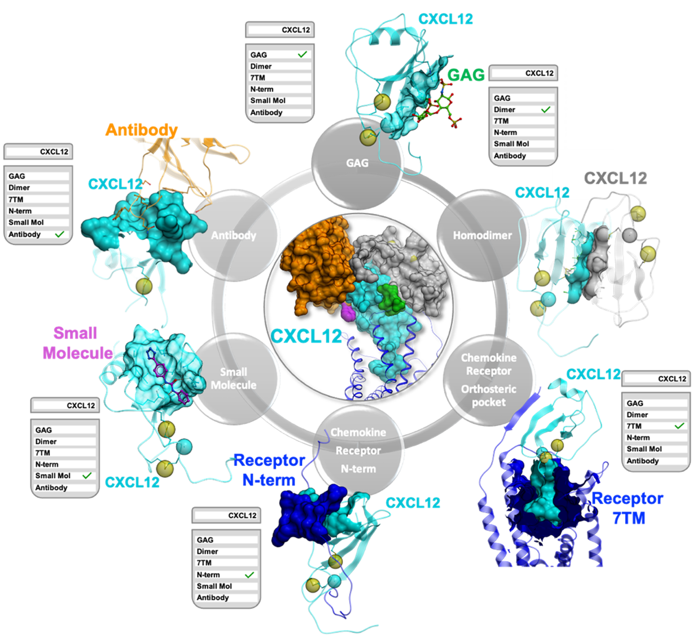

About ChemoPar-db
=================

ChemoPar-db: Exploring Chemokine Interactions
---------------------------------------------

**ChemoPar-db**, the Chemokine Partner Database, is a dedicated structural chemogenomics database for chemokines 
and their diverse binding partners. Chemokines are a unique class of small, secreted signaling proteins that 
play critical roles in immune cell migration, cellular communication, and responses to inflammation and disease,
including cancer and autoimmune disorders.

ChemoPar-db was developed to aid in the understanding of chemokine interactions by offering a specialized resource for the structural
analysis of chemokines. ChemoPar-db is tailored to highlight chemokine interactions with a range of binding partners, including:

- **G-protein coupled receptors (GPCRs):** These are key receptors for chemokines, playing pivotal roles in immune cell communication and migration.
- **Glycosaminoglycans (GAGs):** These are polysaccharides on cell surfaces that interact with chemokines to form stable gradients, assisting in the directed movement of immune cells.
- **Other chemokines:** Chemokines often form dimers or higher-order oligomers with one another, impacting their biological activity.
- **Pathogen-derived proteins:** Pathogens, such as viruses and ticks, can secrete chemokine-binding proteins (CKBPs) to hijack or inhibit chemokine function as a way of evading the immune system.

Platform Features
-----------------
ChemoPar-db compiles a curated selection of chemokine structures from the Protein Data Bank (PDB), adding layers of annotation and sequence alignment to support comparative analysis and structural insights. Key features include:

- **Chemokine and Partner Structures:** Contains detailed structural information on chemokines, including interactions with various classes of binding partners.
- **Molecular Interaction Fingerprints (IFPs):** Each chemokine-partner complex is annotated with molecular interaction fingerprints, enabling systematic comparison of interaction patterns across complexes.
- **Master Sequence Alignment:** Provides a reference alignment of chemokine sequences, facilitating residue-level comparison across different chemokines and subfamilies.
- **User-Friendly Web Interface and API:** The database is accessible through an interactive web interface that allows users to explore chemokine sequences, structural details, and binding partner interactions. The RESTful API enables programmatic access for integrating ChemoPar-db data into custom workflows.

Contributors
------------
ChemoPar-db was developed by a team at the Vrije Universiteit Amsterdam and the University of Copenhagen.
