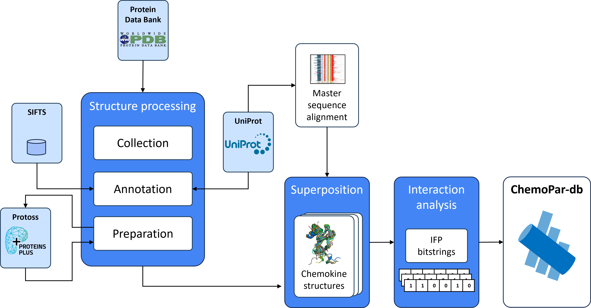
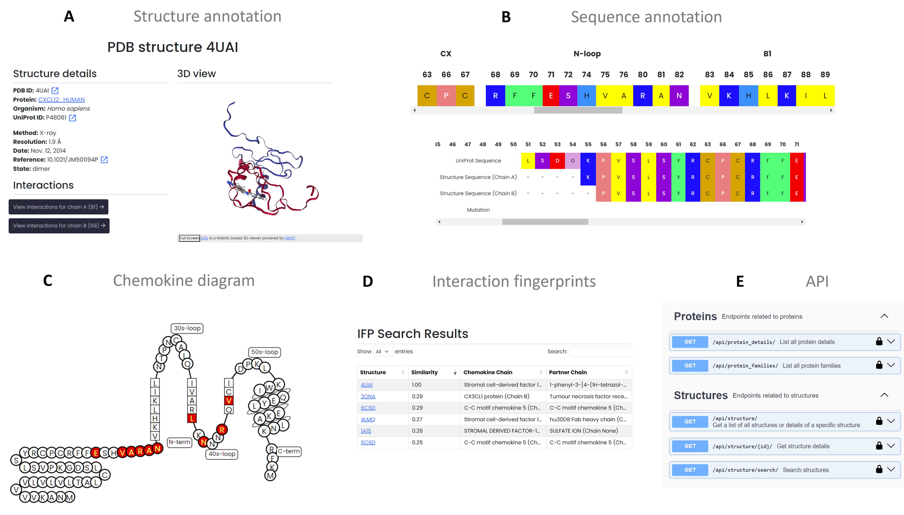

Data collection and processing
==================

Data Collection Workflow
------------------------
ChemoPar-db centralizes structural data for chemokines and their binding partners, offering a unique platform for exploring chemokine interactions in the immune system. Data is collected from various sources, including the Protein Data Bank (PDB) and UniProt, ensuring comprehensive coverage of chemokine structures, sequences, and interaction annotations.

To achieve this, we collected and processed structural data on:
- **Chemokines**: Key signaling proteins with significant roles in immune response and disease.
- **Binding Partners**: Including GPCRs, glycosaminoglycans (GAGs), pathogen-derived proteins, and other chemokines.
- **Interaction Fingerprints**: Detailed molecular interaction fingerprints (IFPs) for annotated interaction analysis.

Each entry in ChemoPar-db is annotated with sequence and structure alignment information, interaction types, and standardized residue numbering, allowing for systematic data exploration. The workflow below summarizes the multi-step data collection and processing pipeline, covering data retrieval, sequence alignment, structure processing, and interaction fingerprint generation.

.. |br| raw:: html

       

Functionalities Snapshot
------------------------
ChemoPar-db provides various functionalities for users to access and analyze chemokine data efficiently. Each function is designed to support in-depth research on chemokine structure and function. Key features include:

- **Chemokine and Structure Browsing**: Browse chemokine entries by name or PDB code, with quick links to associated structures, sequences, and interaction details.
- **Detailed Sequence and Structure Annotations**: Explore structural motifs and sequence alignments, view binding sites, and analyze conserved regions across chemokine subfamilies.
- **Interaction Visualization**: Visualize chemokine-partner interactions using molecular fingerprints, and perform similarity searches based on interaction profiles.
- **RESTful API Access**: Retrieve chemokine data programmatically for integration into bioinformatics workflows.

Below is a snapshot of ChemoPar-db's functionalities, demonstrating the primary data retrieval and analysis options available to users.

