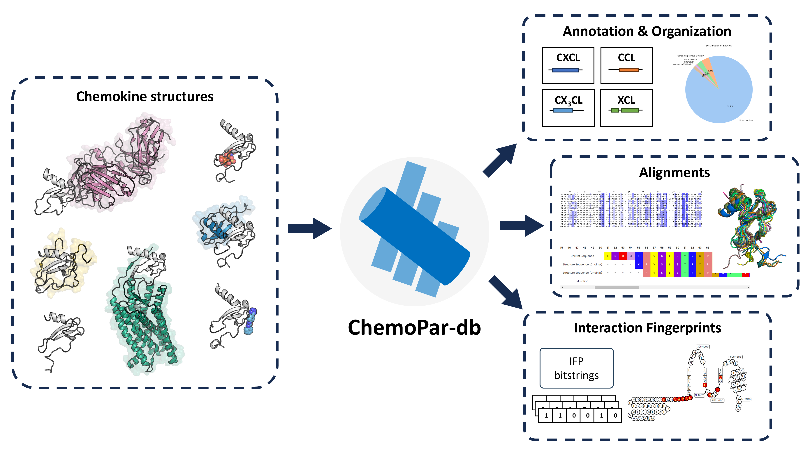

========================================
Welcome to the ChemoPar-db documentation
========================================

**ChemoPar-db** (the Chemokine Partner Database) is a specialized structural protein database focused on chemokines. 
Chemokines interact with multiple binding partners, including GPCRs, glycosaminoglycans, other chemokines, 
and pathogen-derived proteins, making them essential players in immune cell communication, inflammation, and disease processes.
Users can browse all chemokine structures and inspect the molecular interactions between chemokines and their binding partners.

Features
========

The database offers the following features:

- **Browse and Search**: A user-friendly search interface for finding chemokine structures, sequences, and interaction partners.
- **Protein Information**: Detailed annotations for each chemokine, including structural motifs and binding sites.
- **Structure Page**: View structure details, including resolution, experimental method, and oligomeric states.
- **Interaction Analysis**: Visualization and tabulation of molecular interactions with binding partners, downloadable as Excel files.
- **RESTful API**: Programmatic access for data integration into custom workflows, available at https://chemopar-db.net/api.

Overview
========

Chemokines are small, secreted signaling proteins essential for immune cell migration and cellular communication. They play key roles in inflammatory responses and disease states, including cancer and autoimmune conditions. Given the unique interaction profiles of chemokines with GPCRs, glycosaminoglycans (GAGs), other chemokines, and pathogen-derived proteins, ChemoPar-db offers a valuable tool for understanding these complex interactions.

Getting Started
==================

ChemoPar-db is freely accessible to all users at https://chemopar-db.net, with both web and programmatic API access. Researchers can retrieve sequence data, structure files, and interaction fingerprints to support bioinformatics and cheminformatics applications.

.. note::
   ChemoPar-db is still under active development

.. _user-docs:

.. toctree::
   :maxdepth: 2
   :caption: User documentation

   overview
   proteins
   structures
   interactions
   api

.. _about-docs:

.. toctree::
   :maxdepth: 2
   :caption: About ChemoPar-db

   about
   contact
   citing_chemopar-db