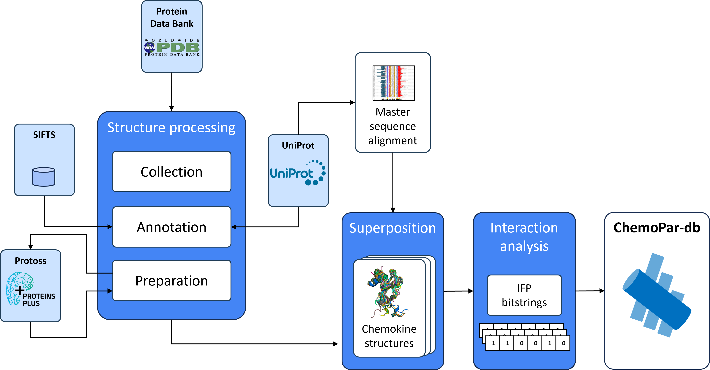
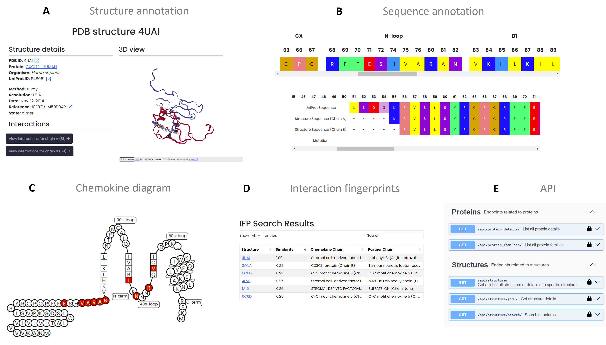

Overview
==============================

Data Collection Workflow
------------------------
ChemoPar-db centralizes structural data for chemokines and their binding partners, offering a unique platform for exploring chemokine interactions. Data is collected from various sources, including the Protein Data Bank (PDB) and UniProt, ensuring comprehensive coverage of chemokine structures, sequences, and interaction annotations.
Each entry in ChemoPar-db is annotated with sequence and structure alignment information, interaction types, and standardized residue numbering, allowing for systematic data exploration. The workflow below summarizes the multi-step data collection and processing pipeline, covering data retrieval, sequence alignment, structure processing, and interaction fingerprint generation.

.. |br| raw:: html

       

Functionalities
---------------
ChemoPar-db provides various functionalities for users to access and analyze chemokine data efficiently. Each function is designed to support in-depth research on chemokine structure and function. Key features include:

- **A. Chemokine and Structure Browsing**: Browse entries by chemokine name or PDB code with quick links to structures, sequences, and interaction details.
- **B. Sequence Annotation and Alignment**: Annotate structural motifs based on master sequence alignment, enabling easy comparison of chemokines.
- **C. Interactive Chemokine Diagrams**: Customize 2D chemokine diagrams that display interacting residues.
- **D. Interaction Fingerprints**: Annotate chemokine-partner complexes with molecular interaction fingerprints and enable similarity searches based on interaction profiles.
- **E. RESTful API Access**: Programmatically retrieve chemokine data for bioinformatics integration.

